# 🏥 Soft Nova Care

**Soft Nova Care** es un sistema de gestión de citas médicas desarrollado como proyecto final para la asignatura **Programación 1** del Instituto Tecnológico de las Américas (ITLA).  
El sistema permite a distintos usuarios interactuar con una clínica según su rol: **Secretaria**, **Doctor** o **Administrador**.

---

## 🧩 Tecnologías utilizadas

- **Lenguaje de programación:** Java
- **Interfaz gráfica:** Java Swing
- **Base de datos:** MySQL / SQL estándar
- **Arquitectura:** MVC (Modelo-Vista-Controlador)  
- **Patrón de diseño:** DAO (Data Access Object)
---

## 👥 Roles del sistema

### 👩‍💼 Secretaria
- Registrar y editar pacientes del consultorio.
- Agendar citas médicas.
- Ver y gestionar el listado de citas.

### 👨‍⚕️ Doctor
- Consultar sus citas medicas del dia.

### 👨‍💻 Administrador
- Registrar y editar pacientes del consultorio.
- Agendar citas médicas.
- Ver y gestionar el listado de citas.
- Crear, modificar y desactivar usuarios del sistema.
- Gestionar los doctores, asociarles horarios y especialidades.
- Agregar, modificar y eliminar especialidades.
- Agregar, modificar y eliminar servicios del consultorio.
- Consultar el historial de pagos.
- Registrar y eliminar metodos de que utiliza el consultorio.

---
### Capturas del software en funcionamiento.
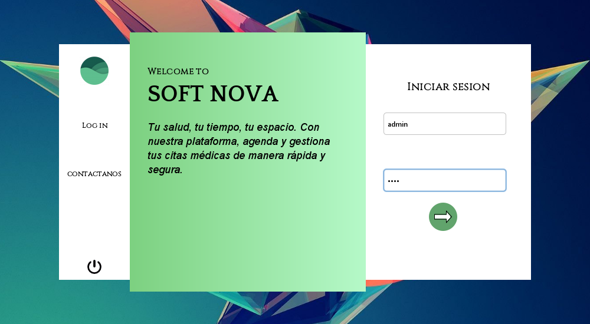
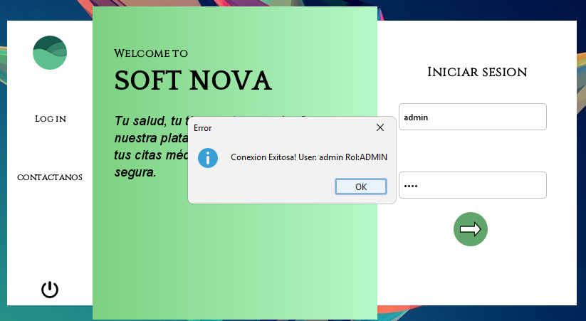
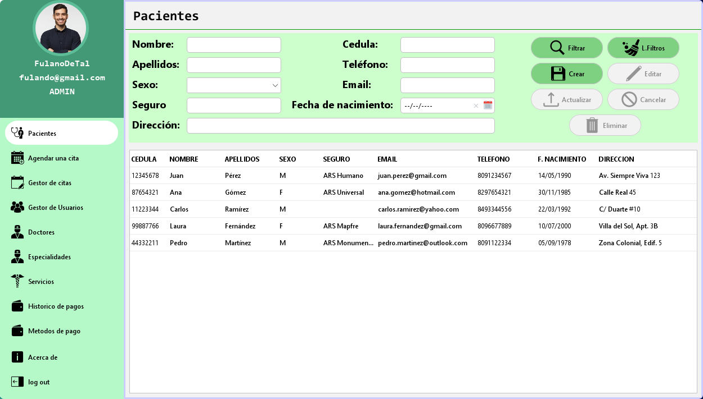
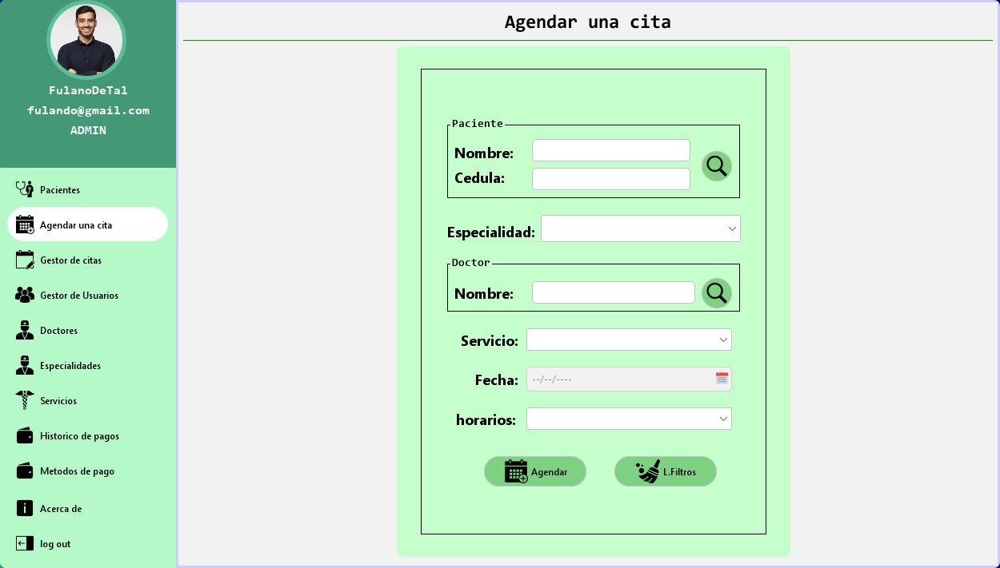
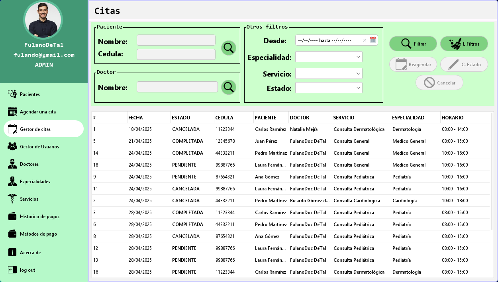
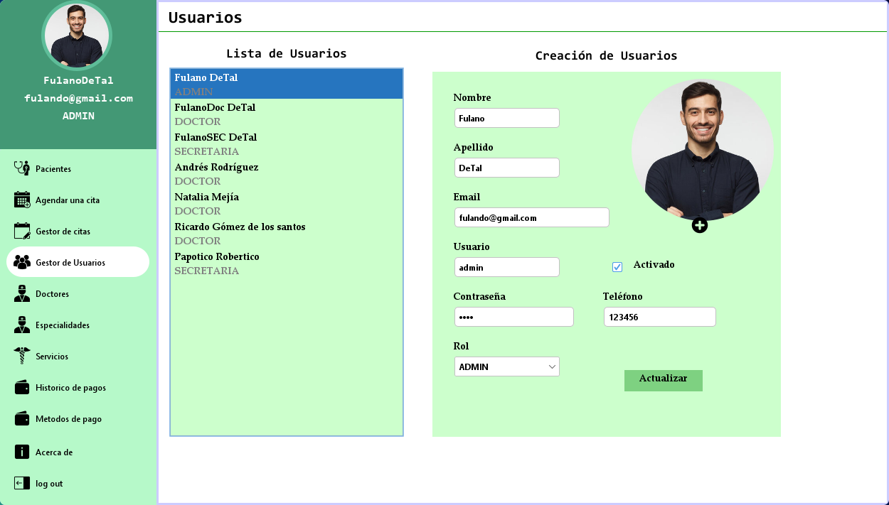
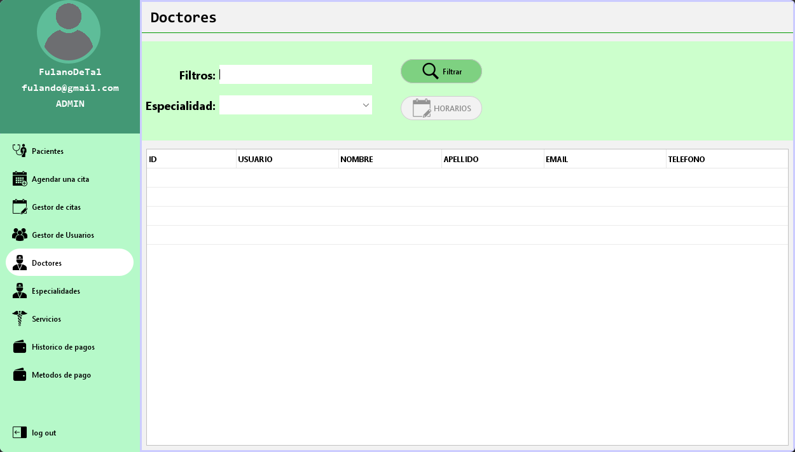
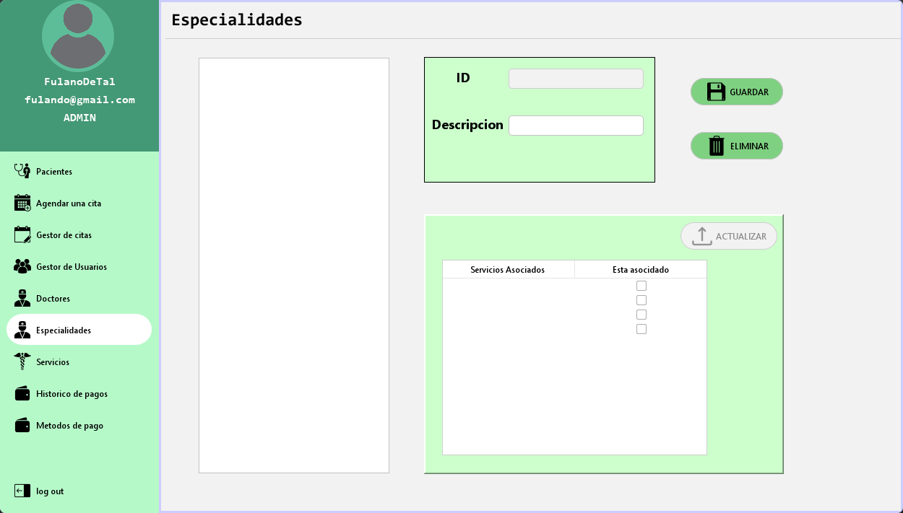
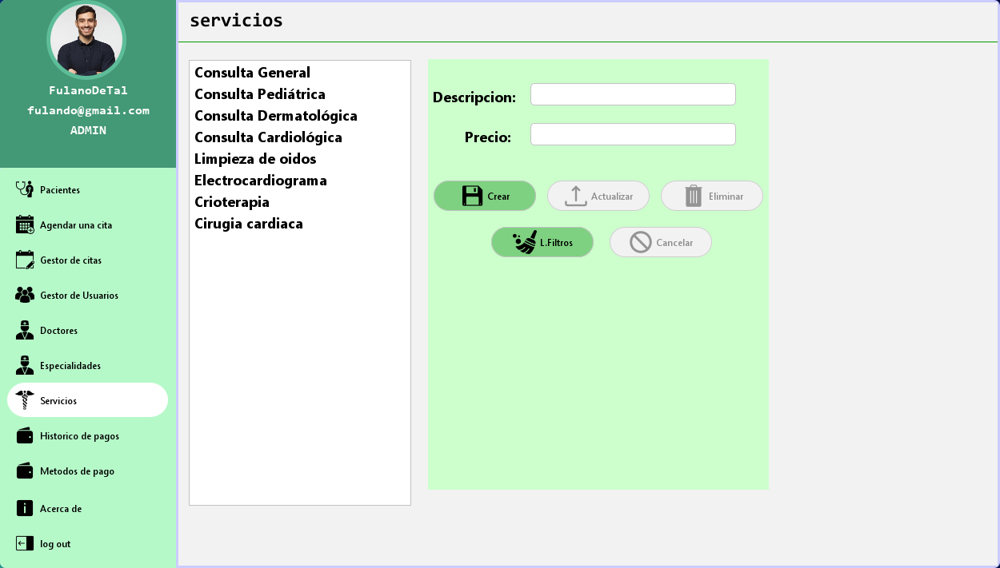
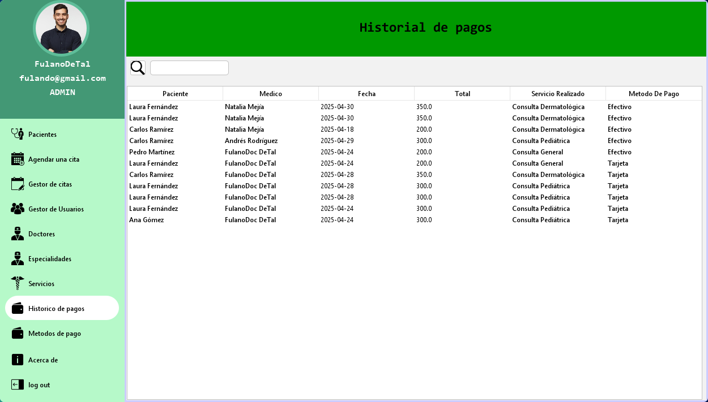
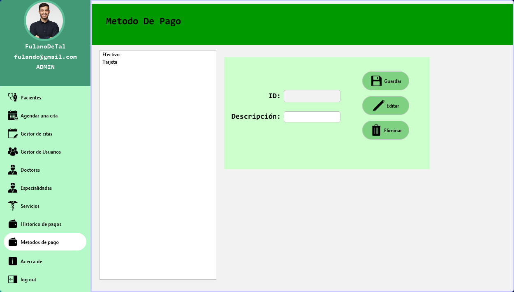
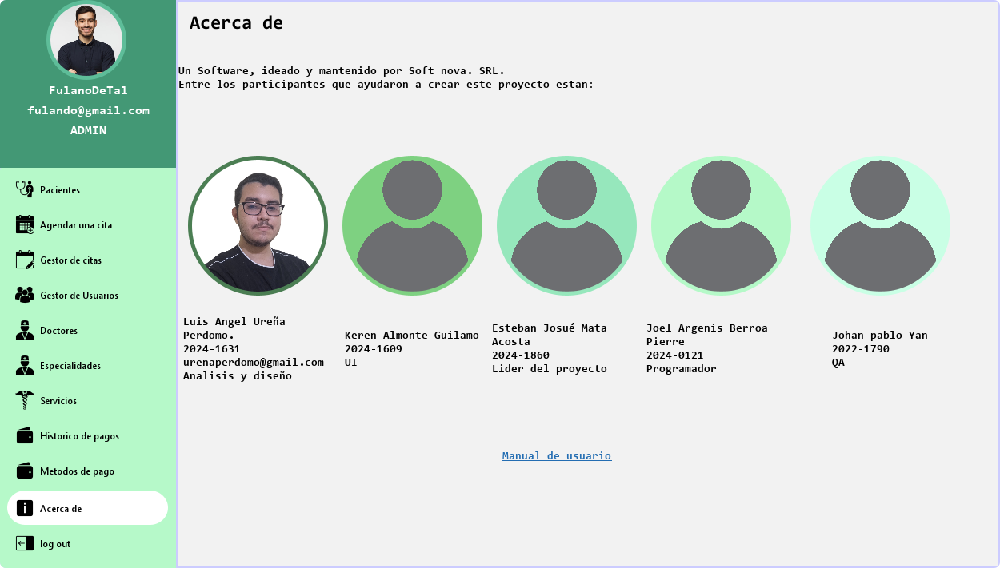
